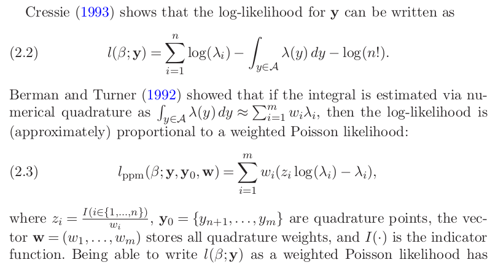
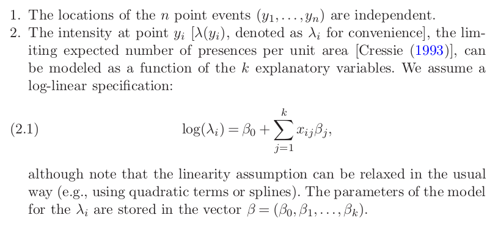

```{r setup, include=FALSE}
# Settings
knitr::opts_chunk$set(include = T, eval = T, echo = F, message = F, warning = F)

# Load packages
library('sf');library('spatstat')

# Load data
basedir <- if (Sys.info()['sysname'] == 'Windows') '/Users/lille/Dropbox/' else '/home/jrl/'
load(paste0(basedir, 'doct/popsup/data/pointpattern.Rda'))
adrs <- readRDS(paste0(basedir, 'doct/popsup/data/addresses_geocoded.Rds'))$data
load(paste0(basedir, 'doct/popsup/data/maps.Rda'))
```

---

``` {r}
par(mar = rep(0, 4), oma = rep(0, 4))
payDen <- density(payPp, sigma = 1e4)
persp(payDen, box = F, main = NULL, mar = rep(0, 4), oma = rep(0, 4))
```

# Research questions

## Grounds for research {.left}

<br>
<small>
*Regulation (EU) No 1305/2013 of the European Parliament and of the Council of 17 December 2013 on support for rural development by the European Agricultural Fund for Rural Development (EAFRD) and repealing Council Regulation (EC) No 1698/200*

Article 3. Mission

The EAFRD shall contribute to the Europe 2020 Strategy by promoting sustainable rural development throughout the Union in a manner that complements the other instruments of the CAP, the cohesion policy and the common fisheries policy. It shall contribute to the development of a Union agricultural sector that is more **territorially and environmentally balanced**, climate-friendly and resilient and competitive and innovative. It shall also contribute to the **development of rural territories**.

Article 4. Objectives

Within the overall framework of the CAP, support for rural development, including for activities in the food and non-food sector and in forestry, shall contribute to achieving the following objectives:

- fostering the competitiveness of agriculture;
- ensuring the sustainable management of natural resources, and climate action;
- achieving a **balanced territorial development of rural economies and communities** including the creation and maintenance of employment.
</small>

## Literature {.left}

<br>
<small>
Galluzzo, N. (2016). Analysis of Financial Subsidies Allocated By the Common Economic-Territorial Inequalities By Indexes of Concentration. Studia Ubb Geographia, 2016(1), 27–38.

Esposti, R. (2007). Regional growth and policies in the european union: Does the common agricultural policy have a counter-treatment effect? American Journal of Agricultural Economics, 89(1), 116–134.

Dax, T., & and Gerhard Hovorka. (2007). The territorial dimension of the Common Agricultural and Rural Development policy (CAP) and its relation to cohesion objectives.
</small>

## Spatial symmetry of payments

<br>
How evenly distributed are the payments? 

<br>
Are there diferences between north-south or west-east?

<br>
Is there substantial clustering in the spatial distribution?

## Explanations for spatial distribution of payments {.left}

<br>
What explains the location of payments?

- Population (number of people)
- Level of development (change in population)
- Land use (perennial and permanent crops)
- Suitability for farming (elevation, soil quality)
- ...

<br>
Is there an interaction between the size of payments and effects of predictors?


# Methodology for spatial problems

## Simple comparison of regions

``` {r}
area <- st_geometry(nutsMap[nutsMap$LEVL_CODE == 1, ]) %>% 
  st_crop(xmin = 4e6, xmax = 5e6, ymin = 3e6, ymax = 4e6)

par(mar = rep(0, 4), oma = rep(0, 4))
plot(area, col = c('red', 'cornflowerblue', 'gray'), main = NULL)
```

Spatial dependency is ignored.

## Spatial regression models (conventional)

<!-- Bounding regions or distance between centroids are considered.-->

``` {r}
par(mar = rep(0, 4), oma = rep(0, 4))
plot(area, col = NA, main = NULL)
area %>% st_centroid %>% plot(add = T, pch = 16, col = 'red')
```

Spatial dependency is partly controlled for.

## Point patttern analysis methods

<!-- Only consider distance between points.-->

``` {r}
par(mar = rep(0, 4), oma = rep(0, 4))
plot(area, col = NA, main = NULL, border = 'gray80')
plot(rpoispp(2e-10, win = as.owin(area)), add = T, cex = .8, col = 'cornflowerblue')
plot(rpoispp(2e-10, win = as.owin(area)), add = T, cex = .8, col = 'red')
```

Spatial dependency is (largely) controlled for.

# (De)limitations

---

<br>
Payments are likely to be related to points where offices are located rather than where actually used.

<br>
Measures related to the payments may be a significant predictor but are currently no considered.

<br>
Data may not available for the entire EU.

# Data

## Data source {.left}

<br>
<small>
*Regulation (EU) No 1306/2013 of the European Parliament and of the Council of 17 December 2013 on the financing, management and monitoring of the common agricultural policySearch for available translations of the preceding (Article 111, point 1)*

Member States shall ensure annual ex-post publication of the beneficiaries of the Funds. The publication shall contain:

- without prejudice to the first paragraph of Article 112 of this Regulation, the name of the beneficiary, as follows: [...]
- **the municipality** where the beneficiary is resident or is registered and, where available, the postal code or the part thereof identifying the municipality;
- the **amounts of payment** corresponding to each measure financed by the Funds received by each beneficiary in the financial year concerned;
- the **nature and the description of the measures** financed by either of the Funds and under which the payment referred to in point (c) is awarded.

The information referred to in the first subparagraph shall be made available on a single website per Member State. It shall remain available for two years from the date of the initial publication.
</small>

## From addresses to coordinates

Geocoding using OpenCage API. A total of `r sum(!is.na(adrs$geometry.lat))` addresses are currently geocoded.

``` {r}
par(mar = c(4,8,2,2))
tab <- tail(sort(table(adrs$components._type)))
barplot(tab, horiz = T, las = 1, xlab = "Number of addresses", col = 'cornflowerblue')
```

## Data availability

Is it possible to download all data at a time?

``` {r}
plot(cntrMap['download'], main = NULL, pal = c('red', 'cornflowerblue'))
```

---

Is it possible to query all data at a time?

``` {r}
plot(cntrMap['online'], main = NULL, pal = c('red', 'cornflowerblue'))
```

# Results <br> Simple methods

## Visual inspection

Kernel density estimates (KDE) of payments

``` {r}
par(mar = c(0,0,0,2), oma = rep(0, 4))
payDen <- density(payPp, sigma = 1e4)
plot(payDen, box = F, main = NULL)
```

---

KDE of payments and population

``` {r}
popDen <- density(popPp, sigma = 1e4)
popDenW <- density(popPp, sigma = 1e4, weights = marks(popPp)$TOT_P)
par(mfrow = c(1,3), mar = c(2,0,2,0), oma = rep(0, 4))
plot(payDen, box = F, main = "Payments (KDE)", ribside = 'bottom')
plot(popDen, box = F, main = "Popluation (KDE)", ribside = 'bottom')
plot(popDenW, box = F, main = "Popluation (KDE, weighted)", ribside = 'bottom')
```

## Distance to nearest neighbours

Summary statistics of *k* nearest neighbours

``` {r}
summary(nndist(payPp, k = 1:4))
```

--- 

``` {r}
nDistEst <- function(x, fun) fun(nndist(payPp, k = x))
plot(1:10, sapply(1:10, nDistEst, mean), type = 'l', col = 'red', 
     xlab = 'Neighbour rank', ylab = "Distance to neighbour estimate (meters)")
lines(1:10, sapply(1:10, nDistEst, median), col = 'cornflowerblue')
legend(x = 'topleft', y = c('Mean', "Median"), fill = c('red', 'cornflowerblue'))
```

## Quadrat analysis

<!-- Most basic test of complete spatial randomness (CSR). -->

Number of payments in a 1x2 and 2x1 matrix quadrats

``` {r}
par(mfrow = c(1,2))
payQuadNS <- quadratcount(payPp, nx = 1, ny = 2)
payQuadWE <- quadratcount(payPp, nx = 2, ny = 1)
plot(payPp, use.marks = F, pch = '.', main = NULL); plot(payQuadNS, add = T)
plot(payPp, use.marks = F, pch = '.', main = NULL); plot(payQuadWE, add = T)
```

---

Number of payments in a 12x10 matrix quadrats.

``` {r}
par(mar = rep(0, 4), oma = rep(0, 4))
payQuad <- quadratcount(payPp, nx = 12, ny = 10)
plot(payPp, use.marks = F, pch = '.', main = NULL); plot(payQuad, add = T)
```

---

``` {r echo = T}
quadrat.test(quadratcount(payPp, nx = 1, ny = 2), method = 'Chisq')
quadrat.test(quadratcount(payPp, nx = 2, ny = 1), method = 'Chisq')
quadrat.test(quadratcount(payPp, nx = 12, ny = 10), method = 'Chisq')
```

# Results <br> Poisson point process model

## Likelihood function specification



<small>
Warton, D. I., & Shepherd, L. C. (2010). Poisson point process models solve the “pseudo-absence problem” for presence-only data in ecology. Annals of Applied Statistics, 4(3), 1383–1402. https://doi.org/10.1214/10-AOAS331
</small>

## Assumptions



<small>
Warton, D. I., & Shepherd, L. C. (2010). Poisson point process models solve the “pseudo-absence problem” for presence-only data in ecology. Annals of Applied Statistics, 4(3), 1383–1402. https://doi.org/10.1214/10-AOAS331
</small>

## Predictors

``` {r}
makeIm <- function(data, weights) pixellate.ppp(data, eps = 1e4, weights = weights)
popIm <- makeIm(popPp, popPp$marks$TOT_P)
trendIm <- makeIm(popPp, as.numeric(popPp$marks$change > 0)) 
elevIm <- makeIm(luPp, luPp$marks$ELEV)
arableIm <- makeIm(luPp, as.numeric(luPp$marks$strata == 'Arable land')) 
permIm <- makeIm(luPp, as.numeric(luPp$marks$strata == 'Permanent crops'))
artifIm <- makeIm(luPp, as.numeric(luPp$marks$strata == 'Artificial, construction and sealed areas'))

par(mfrow = c(2,3), mar = c(0,0,2,2), oma = rep(0, 4))
plot(popIm, box = F, main = "Population")
plot(trendIm, box = F, main = "Population trend") 
plot(elevIm, box = F, main = "Elevation")
plot(arableIm, box = F, main = "Arable land")
plot(permIm, box = F, main = "Permanent cultures")
plot(artifIm, box = F, main = "Artificial landscape")
```

## Full models

``` {r}
## Split payments point pattern by total sum into quantiles
#quants <- quantile(payPp$marks$total, probs = seq(0,1,.25)) # Define quantiles
#payPpLs <- split(payPp, f = cut(payPp$marks$total, quants))
```

**Lowest** payment sum quartile points as response

``` {r}
ppmQuant <- function(response) {
  ppm(response ~ popIm + trendIm + elevIm + arableIm + permIm + artifIm)
}

ppmQuant(unmark(payPpLs[[1]]))
```

---

**Highest** payment sum quartile points as response

``` {r}
ppmQuant(unmark(payPpLs[[4]]))
```

## Population effects

``` {r echo = T}
(model <- ppm(unmark(payPp) ~ popIm + trendIm + artifIm))
```

---

Conditional intensity of payments as predicted by model with **population** variables as predictors.

``` {r}
plot(model, ngrid = 60, superimpose = F, how = 'image', se = F, box = F, main = NULL)
```

## Landscape effects

``` {r echo = T}
(model <- ppm(unmark(payPp) ~ elevIm + arableIm + permIm))
```

---

Conditional intensity of payments as predicted by model with **landscape** variables as predictors.

``` {r}
plot(model, ngrid = 60, superimpose = F, how = 'image', se = F, box = F, main = NULL)
```

## All effects

``` {r}
(model <- ppm(unmark(payPp) ~ popIm + trendIm + elevIm + arableIm + permIm + artifIm))
```

---

Intensity of payments as predicted by model by full model and actual KDE of payments.

``` {r}
par(mfrow = c(1,2), mar = c(2,0,2,0), oma = rep(0, 4))
plot(model, ngrid = 60, superimpose = F, how = 'image', se = F, box = F, ribside = 'bottom', 
       main = "Model predicted conditional intensity")
payDen <- density(payPp, sigma = 1e4)
plot(payDen, box = F, ribside = 'bottom', main = "KDE of payments")
```

# Conclusions

## Spatial symmetry of payments

<br>
Distribution is not spatially symmetrical. 

Divides between different parts of the country are apparent.

<br>
Payments cluster in settlements.

## Explanations for spatial distribution of payments

<br>
There is positive effect of population, its trend and agricultural land use. Elevation has a negative effect.

<br>
The location of payments with lower value is not as significantly explained by population and artificial landscape when compared to highest valued payments.

# That's it!

## Resources  {.left}

<small>
<section style="text-align: left;">
- R Core Team (2018). R: A language and environment for statistical computing. R Foundation for Statistical Computing, Vienna, Austria. URL https://www.R-project.org/.
- Maelle Salmon (2018). opencage: Interface to the OpenCage API. R package version 0.1.4. URL https://CRAN.R-project.org/package=opencage.
- Edzer Pebesma (2018). sf: Simple Features for R. R package version 0.6-3. URL https://CRAN.R-project.org/package=sf.
- Adrian Baddeley, Ege Rubak, Rolf Turner (2015). Spatial Point Patterns: Methodology and Applications with R. London: Chapman and Hall/CRC Press, 2015. URL http://www.crcpress.com/Spatial-Point-Patterns-Methodology-and-Applications-with-R/Baddeley-Rubak-Turner/9781482210200/.
</section>
</small>
